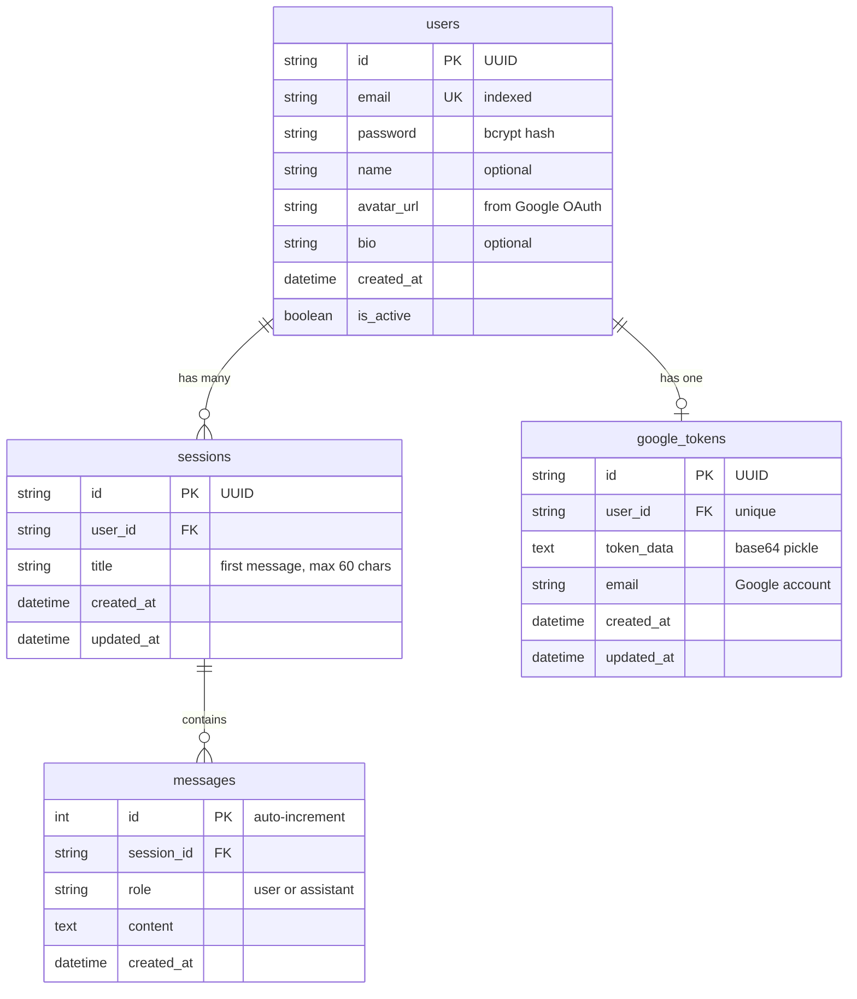

# AI Action Assistant

**A personal AI that doesn't just talk — it executes.** Send emails, schedule
calendar events, fetch live data, search the web, and summarize documents
through a single natural language interface.

[](https://python.org)
[](https://fastapi.tiangolo.com)
[](https://groq.com)
[](https://modelcontextprotocol.io)
[](./LICENSE)
[](https://github.com/yashsakariya04/Ai-action-assistant)
[](https://github.com/yashsakariya04/Ai-action-assistant)

[**View on GitHub**](https://github.com/yashsakariya04/Ai-action-assistant)

---

## Project Overview

AI Action Assistant is a full agentic AI system built with Python and FastAPI
that processes natural language commands and executes real-world actions through
verified API integrations. It enforces a strict separation between LLM
reasoning and Python execution — the LLM classifies intent and extracts
arguments, but every email, calendar event, API call, and database write is
performed exclusively by Python code with a validation layer in between. The
system includes JWT authentication, per-user Google OAuth2, a 7-step chat
processing pipeline, a RAG knowledge base, and a complete MCP server exposing
9 tools for Claude Desktop and Cursor IDE integration.

---

## Problem Statement

Most AI assistant projects wrap an LLM API, display the response, and call it
a day. When they claim to "send an email," the LLM generates text that looks
like an email — but nothing actually sends. When dates or addresses are
needed, the model hallucinates plausible-sounding but fabricated data.

AI Action Assistant solves this by treating the LLM as a reasoning engine only.
Every real-world action flows through a Python validation layer and executes
via authenticated API calls, with mandatory user confirmation for irreversible
operations.

---

## Key Features

### Action Execution
- Sends real emails via Gmail API (OAuth2) — not simulated output
- Creates Google Calendar events with reminders, timezone support,
  and event links
- Fetches live weather data from OpenWeatherMap for any city worldwide
- Retrieves news headlines from NewsAPI with DuckDuckGo web search fallback
- Searches the internet via DuckDuckGo + Wikipedia API fallback chain
- Summarizes PDFs, DOCX files, XLSX spreadsheets, URLs, and raw text

### Anti-Hallucination System
- Email addresses are regex-verified against the user's actual messages —
  the LLM cannot fabricate recipients
- Calendar dates are parsed and validated as real future timestamps
- Placeholder patterns (`[INSERT`, `<YOUR`, `[TODO`) are detected and
  rejected in email bodies
- Every irreversible action (email, calendar) shows a full preview
  and requires explicit "yes" confirmation

### Intelligent Conversation
- 7-step processing pipeline handles intent detection, field collection,
  validation, drafting, preview, and execution in a single conversational flow
- Multi-turn field collection: missing information is requested one field at
  a time via natural language prompts
- Rolling conversation memory with LLM-powered compression — older turns
  are summarized to stay within context limits
- RAG knowledge base backed by ChromaDB and Sentence Transformers for
  domain-specific Q&A

### Multi-Client Architecture
- Web UI served via FastAPI (login, signup, dashboard — vanilla HTML/CSS/JS)
- MCP server with 9 tools for Claude Desktop, Cursor IDE, and any MCP client
- RESTful API with Swagger docs at `/docs`
- Terminal test client for local development

### Production Infrastructure
- JWT authentication with bcrypt password hashing
- Per-user Google OAuth2 — each user connects their own Google account
- 3-tier LLM routing across separate API keys to maximize free-tier budgets
- In-memory rate limiting (30 requests / 60 seconds per session)
- SQLite locally, PostgreSQL on Railway — zero code changes
- Docker container with CPU-only PyTorch (800 MB vs 3.5 GB CUDA)

---

## Tech Stack

| Layer        | Technology                          | Purpose                                   |
|:-------------|:------------------------------------|:------------------------------------------|
| Language     | Python 3.11                         | Core runtime                              |
| LLM          | Groq API (3-tier model routing)     | Intent detection, drafting, formatting    |
| STT          | Groq Whisper (whisper-large-v3-turbo) | Speech-to-text transcription            |
| Backend      | FastAPI + Uvicorn                   | REST API server                           |
| Auth         | JWT (python-jose) + bcrypt          | Stateless authentication                  |
| Database     | SQLAlchemy ORM — SQLite / PostgreSQL | User, session, message persistence       |
| Vector DB    | ChromaDB (persistent local)         | RAG document storage and retrieval        |
| Embeddings   | Sentence Transformers (all-MiniLM-L6-v2) | 384-dim vector embeddings            |
| Email        | Gmail API (OAuth2)                  | Authenticated email sending               |
| Calendar     | Google Calendar API (OAuth2)        | Event creation with reminders             |
| News         | NewsAPI + DuckDuckGo fallback       | Live news headlines                       |
| Weather      | OpenWeatherMap API                  | Real-time weather data                    |
| Search       | DuckDuckGo (ddgs) + Wikipedia API   | Internet search with fallback chain       |
| Files        | pypdf, python-docx, pandas, BS4    | Document parsing and text extraction      |
| Protocol     | MCP via FastMCP                     | Claude Desktop / Cursor IDE integration   |
| Frontend     | Vanilla HTML / CSS / JS             | No framework, no build step               |
| Fonts        | Geist Mono + DM Sans (Google Fonts) | Terminal-inspired dark UI aesthetic        |
| Deployment   | Docker + Railway                    | Production hosting with health checks     |

---

## System Architecture

```mermaid
graph TB
    subgraph Clients
        A1[Browser — Login / Signup / Dashboard]
        A2[Claude Desktop / Cursor IDE]
        A3[Terminal Test Client]
    end

    subgraph Auth Layer
        B1[JWT Bearer Token Validation]
        B2[Per-User Google OAuth2]
    end

    subgraph API Gateway — FastAPI
        C1[POST /chat — Main Chat Endpoint]
        C2[POST /auth/register — Signup]
        C3[POST /auth/login — Sign In]
        C4[GET /sessions — Chat History]
        C5[POST /voice/transcribe — STT]
        C6[GET /health — System Health]
    end

    subgraph Chat Engine — 7-Step Pipeline
        D1["1. Confirmation Detection"]
        D2["2. Action Planning (LLM)"]
        D3["3. RAG Answer Synthesis"]
        D4["4. Direct Execution"]
        D5["5. Email Auto-Draft (LLM)"]
        D6["6. Missing Field Collection"]
        D7["7. Preview + Confirm Gate"]
    end

    subgraph Validator Layer
        E1[Email Regex vs User Messages]
        E2[Datetime Parsing + Future Check]
        E3[Placeholder Pattern Detection]
        E4[Argument Type Validation]
    end

    subgraph Execution Layer — Python Only
        F1[Gmail API → email_service.py]
        F2[Calendar API → calendar_service.py]
        F3[NewsAPI → news_service.py]
        F4[OpenWeatherMap → weather_service.py]
        F5[DuckDuckGo → web_search_service.py]
        F6[ChromaDB → rag_pipeline.py]
        F7[Summarizer → summarizer_service.py]
    end

    subgraph MCP Server — 9 Tools
        G1[chat — Master Brain]
        G2[weather / news / search / email / calendar / summarize]
        G3[reset_conversation / get_system_status]
    end

    subgraph Data Layer
        H1[(SQLite / PostgreSQL)]
        H2[(ChromaDB Vector Store)]
    end

    A1 --> B1 --> C1 --> D1
    A2 --> G1 --> D1
    A3 --> C1
    D1 --> D2 --> D3 & D4 & D5 & D6 & D7
    D7 --> E1 & E2 & E3 & E4
    E1 & E2 & E3 & E4 --> F1 & F2 & F3 & F4 & F5 & F6 & F7
    F1 & F2 & F3 & F4 & F5 --> H1
    F6 --> H2
    C1 --> H1
```

### Design Decisions

The architecture separates concerns across four strict layers. The **LLM**
handles reasoning only — intent classification, argument extraction, and
content drafting. The **Validator Layer** runs Python-based verification
against every argument before any API call executes. The **Execution Layer**
makes all external API calls with zero LLM involvement. This prevents the
most common failure mode in AI assistant projects: the LLM "pretending"
to execute an action by generating plausible-looking output.

The 3-tier model routing splits LLM workload across three independent Groq
API keys and model sizes. Critical reasoning (intent detection, RAG) uses
the 120B model, content drafting uses the 70B model, and simple formatting
uses the 8B model — maximizing the free-tier token budget across all three.

---

## Folder Structure

```
ai-action-assistant/
│
├── backend/
│   ├── app.py                  # FastAPI app — routes, middleware, lifespan
│   ├── auth.py                 # JWT auth — register, login, get_current_user
│   ├── chat_engine.py          # 7-step processing pipeline (core brain)
│   ├── google_auth.py          # Per-user Google OAuth2 connect/callback
│   ├── session_store.py        # Session management — in-memory + DB persistence
│   └── schemas.py              # Pydantic request/response models
│
├── core/
│   ├── action_controller.py    # Required field validation per action type
│   ├── embedding.py            # Sentence Transformers wrapper
│   ├── ingestion.py            # URL → text ingestion pipeline
│   ├── intent_parser.py        # Datetime extraction helpers
│   ├── llm_service.py          # All LLM calls — 3-tier routing
│   ├── memory_manager.py       # Rolling buffer + LLM compression
│   ├── rag_pipeline.py         # RAG — vector search + LLM synthesis
│   ├── validators.py           # Anti-hallucination validators (460 LOC)
│   └── vector_store.py         # ChromaDB wrapper
│
├── db/
│   ├── database.py             # SQLAlchemy engine + session factory
│   └── models.py               # ORM models — User, GoogleToken, Session, Message
│
├── services/
│   ├── calendar_service.py     # Google Calendar API integration
│   ├── email_service.py        # Gmail API integration
│   ├── news_service.py         # NewsAPI integration
│   ├── summarizer_service.py   # Multi-source summarization (URL/file/text)
│   ├── voice_service.py        # Groq Whisper STT integration
│   ├── weather_service.py      # OpenWeatherMap integration
│   └── web_search_service.py   # DuckDuckGo + Wikipedia fallback
│
├── static/
│   ├── login.html              # Sign-in page (served at / and /login)
│   ├── signup.html             # Account creation (served at /signup)
│   ├── dashboard.html          # Full chat UI (served at /dashboard)
│   ├── profile.html            # User profile + Google OAuth connect
│   └── about.html              # About page
│
├── scripts/
│   ├── calendar_auth.py        # Google OAuth2 flow — generates token.pickle
│   ├── encode_token.py         # Encode token.pickle to base64 for Railway
│   └── startup.py              # Railway startup — decode GOOGLE_TOKEN_B64
│
├── tests/
│   ├── test_mcp.py             # MCP tool test suite (all 9 tools)
│   └── test_terminal.py        # Terminal chat client for local testing
│
├── mcp_server.py               # FastMCP server — 9 tools, 3 resources, 7 prompts
├── config.py                   # Centralized config from environment variables
├── run_api.py                  # FastAPI server entry point (Uvicorn)
├── run_mcp.py                  # MCP server entry point
│
├── Dockerfile                  # Docker container (CPU-only PyTorch)
├── Railway.json                # Railway deployment config
├── requirements.txt            # Python dependencies
└── .env.example                # Full environment variable template
```

---

## Getting Started

### Prerequisites

- Python 3.10+
- A Groq API key (free at [console.groq.com](https://console.groq.com))
- Google Cloud project with Gmail API + Google Calendar API enabled
- NewsAPI key (free at [newsapi.org](https://newsapi.org))
- OpenWeatherMap key (free at [openweathermap.org](https://openweathermap.org/api))

### 1. Clone the repository

```bash
git clone https://github.com/yashsakariya04/Ai-action-assistant.git
cd Ai-action-assistant
```

### 2. Create virtual environment

```bash
python -m venv venv

# Windows
venv\Scripts\activate

# macOS / Linux
source venv/bin/activate
```

### 3. Install dependencies

```bash
pip install -r requirements.txt
```

### 4. Configure environment variables

```bash
cp .env.example .env
```

Edit `.env` with your API keys. At minimum, set:

```env
GROQ_API_KEY_PRIMARY=your_groq_api_key
EMAIL_USER=your_gmail@gmail.com
NEWS_API_KEY=your_newsapi_key
OPENWEATHER_API_KEY=your_openweather_key
```

### 5. Set up Google OAuth (Calendar + Gmail)

Place your `credentials.json` from Google Cloud Console in the
project root, then run:

```bash
python scripts/calendar_auth.py
```

A browser window opens → sign in → allow Calendar and Gmail
permissions → `token.pickle` is saved.

### 6. Start the server

```bash
python run_api.py
```

Visit `http://localhost:8000` → sign up → start chatting.

### Environment Variables

| Variable                 | Required     | Default                  | Description                                  |
|:-------------------------|:-------------|:-------------------------|:---------------------------------------------|
| `GROQ_API_KEY_PRIMARY`   | Yes          | —                        | Groq key for Tier 1 (intent, RAG)            |
| `GROQ_MODEL_PRIMARY`     | No           | `openai/gpt-oss-120b`   | Tier 1 model                                 |
| `GROQ_API_KEY_MEDIUM`    | No           | falls back to PRIMARY    | Groq key for Tier 2 (email, summarize)       |
| `GROQ_MODEL_MEDIUM`      | No           | `llama-3.3-70b-versatile`| Tier 2 model                                |
| `GROQ_API_KEY_LIGHT`     | No           | falls back to PRIMARY    | Groq key for Tier 3 (weather, news)          |
| `GROQ_MODEL_LIGHT`       | No           | `llama-3.1-8b-instant`  | Tier 3 model                                 |
| `EMAIL_USER`             | For email    | —                        | Gmail address (From: header)                 |
| `NEWS_API_KEY`           | For news     | —                        | NewsAPI.org key                              |
| `OPENWEATHER_API_KEY`    | For weather  | —                        | OpenWeatherMap key                           |
| `CALENDAR_TIMEZONE`      | No           | `Asia/Kolkata`           | Timezone for calendar events                 |
| `DATABASE_URL`           | No           | SQLite (local)           | PostgreSQL URL for production                |
| `JWT_SECRET_KEY`         | No           | auto-generated           | JWT signing secret                           |
| `SIMILARITY_THRESHOLD`   | No           | `0.45`                   | RAG vector similarity cutoff                 |
| `RATE_LIMIT_REQUESTS`    | No           | `30`                     | Max requests per session per window          |
| `RATE_LIMIT_WINDOW_SECONDS` | No        | `60`                     | Rate limit window in seconds                 |
| `UPLOAD_MAX_BYTES`       | No           | `10485760` (10 MB)       | Max file upload size                         |
| `GOOGLE_TOKEN_B64`       | Railway only | —                        | Base64-encoded token.pickle                  |
| `GOOGLE_CREDENTIALS_B64` | Railway only | —                        | Base64-encoded credentials.json              |

---

## Usage Guide

### Web Interface

| URL                            | Description                  |
|:-------------------------------|:-----------------------------|
| `http://localhost:8000`        | Login page (entry point)     |
| `http://localhost:8000/signup` | Create account               |
| `http://localhost:8000/dashboard` | Chat dashboard (requires login) |
| `http://localhost:8000/profile` | User profile + Google OAuth  |
| `http://localhost:8000/docs`   | Interactive Swagger API docs |
| `http://localhost:8000/health` | System health check          |

### Common Use Cases

**Check weather:**
> "What's the weather in Mumbai?"

**Send an email:**
> "Send a congratulations email to Ravi for his promotion"
> → AI asks for recipient email → drafts body → shows preview → sends on "yes"

**Schedule a meeting:**
> "Schedule a team standup next Monday at 9am for 1 hour"
> → Shows event preview → creates on Google Calendar on "yes"

**Summarize a document:**
> Upload a PDF/DOCX file → AI extracts text and returns a structured summary

**Search the web:**
> "Search for latest developments in quantum computing"

### MCP Integration (Claude Desktop)

```bash
# Launch MCP Inspector for browser-based tool testing
npx @modelcontextprotocol/inspector python run_mcp.py
# Open http://localhost:5173
```

Add to Claude Desktop config
(`%APPDATA%\Claude\claude_desktop_config.json`):

```json
{
  "mcpServers": {
    "ai-action-assistant": {
      "command": "C:\\path\\to\\python.exe",
      "args": ["run_mcp.py"],
      "cwd": "C:\\path\\to\\Ai-action-assistant"
    }
  }
}
```

### Terminal Client

```bash
python tests/test_terminal.py
```

---

## API Reference

### Auth Endpoints

| Method   | Endpoint                | Body / Auth            | Description                |
|:---------|:------------------------|:-----------------------|:---------------------------|
| `POST`   | `/auth/register`        | `{ email, password, name? }` | Create account, return JWT |
| `POST`   | `/auth/login`           | `form: username, password`   | Sign in, return JWT        |
| `GET`    | `/auth/me`              | Bearer token           | Current user profile       |
| `GET`    | `/auth/google/connect`  | `?token=<jwt>`         | Start Google OAuth flow    |
| `GET`    | `/auth/google/status`   | Bearer token           | Check Google connection    |
| `DELETE` | `/auth/google/disconnect`| Bearer token          | Remove Google token        |

### Chat Endpoints

| Method   | Endpoint      | Auth   | Description                      |
|:---------|:--------------|:-------|:---------------------------------|
| `POST`   | `/chat`       | JWT    | Main chat — JSON or multipart    |
| `POST`   | `/reset`      | JWT    | Reset session memory             |
| `GET`    | `/sessions`   | JWT    | List user's chat sessions        |
| `POST`   | `/voice/transcribe` | JWT | Audio → text via Groq Whisper |
| `GET`    | `/health`     | —      | System health check              |

### Sample Request / Response

```json
// POST /chat
{
  "message": "What is the weather in Mumbai?",
  "session_id": "550e8400-e29b-41d4-a716-446655440000",
  "selected_services": ["weather"]
}
```

```json
// Response
{
  "status": "success",
  "action": "weather",
  "message": "Current weather in Mumbai: 32°C, Humid...",
  "session_id": "550e8400-e29b-41d4-a716-446655440000",
  "news_articles": null
}
```

Status values: `success` · `error` · `pending` (collecting fields) ·
`awaiting` (confirmation required) · `cancelled`

---

## LLM Architecture — 3-Tier Model Routing

The system splits all LLM calls across three independent Groq API keys
to maximize free-tier token budgets and ensure uninterrupted service.

```
TIER 1 — PRIMARY    model: openai/gpt-oss-120b
  ├── plan_action()             Intent detection + argument extraction
  ├── detect_confirmation()     yes / no / new_info classification
  ├── generate_missing_field()  Natural language field collection
  └── get_llm_response()       RAG answer synthesis
  Why: These tasks need the strongest reasoning. Wrong intent = wrong action.

TIER 2 — MEDIUM     model: llama-3.3-70b-versatile
  ├── draft_email()             Professional email writing
  ├── draft_event_description() Calendar event description
  └── Summarization via LLM     Long-context document summarization
  Why: Good writing quality + large context window. Separate quota.

TIER 3 — LIGHT      model: llama-3.1-8b-instant
  ├── Weather response formatting
  ├── News response formatting
  ├── Web search result formatting
  └── Conversation memory compression
  Why: 500k+ TPD free, ultra-fast (~200 tok/s). Simple tasks don't need 120B.
```

**Fallback behavior:** If a tier's key is not set, it falls back to the
primary key automatically. Single-key, two-key, and three-key setups all
work with zero code changes.

---

## Database Schema



---

## MCP Server — 9 Tools

The MCP server is compatible with Claude Desktop, Cursor IDE, and any
MCP client. All tools share session state for seamless multi-turn workflows.

| Tool                  | Type       | Confirms | Description                            |
|:----------------------|:-----------|:---------|:---------------------------------------|
| `chat`                | Master     | Varies   | Natural language routing to all services |
| `weather_service`     | Dedicated  | No       | Current weather for any city            |
| `web_search_service`  | Dedicated  | No       | Internet search via DuckDuckGo + Wiki   |
| `summarizer_service`  | Dedicated  | No       | Summarize URL / text / file             |
| `email_service`       | Dedicated  | Yes      | Full email draft → preview → send       |
| `calendar_service`    | Dedicated  | Yes      | Full calendar → preview → create        |
| `news_service`        | Dedicated  | No       | Live news headlines on any topic        |
| `reset_conversation`  | Utility    | No       | Clear session memory                    |
| `get_system_status`   | Utility    | No       | Health check for all services           |

Additionally exposes 3 resources (`config://settings`, `kb://status`,
`help://guide`) and 7 prompt templates for common workflows.

---

## Screenshots / Demo

<!-- TODO: Add actual screenshots after deployment -->

| Feature | Screenshot |
|:--------|:-----------|
| Login Page |  |
| Dashboard — Chat |  |
| Email Preview + Confirm |  |
| Calendar Event Creation |  |
| MCP Inspector — 9 Tools |  |

---

## Challenges & Engineering Decisions

### 1. Preventing LLM Hallucination in Critical Fields

The LLM reliably fabricated email addresses and dates when given free rein.
The solution: a dedicated `validators.py` module (460 lines) that regex-matches
every email address against the user's actual message history and validates
every date as parseable and in the future. If the LLM outputs
`john@company.com` but the user never typed that address, it gets stripped
and the system asks the user to provide it.

### 2. Multi-Turn Field Collection Without Losing State

Early versions lost conversation context between turns, causing the user to
re-enter information repeatedly. The fix was a `ConversationMemory` class
with a `pending_action` scratchpad that persists partially-collected fields
across turns, merges new user input into the existing action plan, and only
triggers execution when all required fields pass validation.

### 3. Maximizing Free-Tier Token Budgets

A single Groq API key runs out quickly when every call uses the largest model.
The 3-tier architecture routes each function to the smallest model that can
handle it reliably — intent detection needs the 120B model, but formatting
a weather response works with the 8B model. Each tier uses an independent
API key, tripling the effective daily token budget.

### 4. Confirmation Gate for Irreversible Actions

Early versions executed email sends immediately after the LLM planned them.
The confirmation gate architecture introduces an `awaiting_confirmation`
state on each session. Email and calendar actions render a full preview card,
then pause execution until the user explicitly confirms. The LLM classifies
the user's response as `confirm`, `cancel`, or `new_info` — and the
classification itself is validated against keyword patterns as a fallback.

### 5. Docker Image Size Optimization

The default PyTorch wheel with CUDA support is ~3.5 GB. Since the project
only needs CPU inference for Sentence Transformers embeddings, the Dockerfile
pins `torch==2.2.2` from the CPU-only index, pinning NumPy < 2 first to avoid
binary incompatibility. This reduces the container image by ~2.7 GB.

---

## Roadmap

### Short-term
- [ ] Streaming responses via Server-Sent Events (SSE)
- [ ] Redis-backed session store for horizontal scaling
- [ ] Comprehensive unit and integration test suite

### Mid-term
- [ ] Agent orchestrator layer with BaseTool framework
- [ ] Multi-user sessions with role-based access
- [ ] Webhook integrations (Slack, Discord, Telegram)
- [ ] CI/CD pipeline with GitHub Actions

### Long-term
- [ ] Plugin architecture for third-party tool registration
- [ ] Fine-tuned intent classification model to replace prompt-based planning
- [ ] Kubernetes deployment manifests
- [ ] End-to-end encryption for message storage

---

## What I Learned

- **Execution separation is non-negotiable in agentic AI.** Letting the LLM
  "pretend" to execute actions produces impressive demos but zero reliability.
  Strict boundaries between reasoning and execution eliminated an entire class
  of bugs.

- **Validation layers prevent more issues than better prompts.** Prompt
  engineering alone could not stop the LLM from fabricating email addresses.
  A 460-line Python validation module solved the problem deterministically.

- **Token budget management is an architecture concern, not an afterthought.**
  The 3-tier model routing was born from hitting rate limits daily during
  development. Matching task complexity to model capability was the only
  sustainable solution on free-tier APIs.

- **Multi-turn state management is the hardest part of conversational AI.**
  Nine rebuilds of the chat engine taught me that field collection,
  confirmation flows, and context merging require explicit state machines —
  not implicit LLM memory.

- **Docker optimization directly impacts deployment costs.** Cutting 2.7 GB
  from the container image by using CPU-only PyTorch and pinning NumPy
  reduced Railway build times and stayed within free-tier resource limits.

- **MCP protocol design shapes tool usability.** Writing detailed docstrings,
  examples, and type annotations for each MCP tool directly improved how
  Claude Desktop and Cursor IDE discovered and used the tools.

---

## Why This Project Stands Out

- **It executes, not simulates.** Every action flows through authenticated
  API calls with real-world side effects — Gmail sends real emails, Google
  Calendar creates real events, and the user can verify results immediately.

- **Anti-hallucination is engineered, not prompted.** A dedicated 460-line
  validation module enforces data integrity constraints that no prompt
  engineering can guarantee, including cross-referencing LLM output against
  the user's actual message history.

- **The architecture reflects production thinking.** 3-tier LLM routing,
  per-user OAuth2, JWT auth, rate limiting, database abstraction, Docker
  optimization, and MCP protocol support are decisions driven by real
  constraints, not resume padding.

- **It survived 9 complete rebuilds.** Each rebuild identified and fixed a
  fundamental design flaw — from execution separation to state management
  to hallucination prevention — producing a system that is genuinely stable.

---

## Contributing

Contributions are welcome. To get started:

1. Fork the repository
2. Create a feature branch: `git checkout -b feature/your-feature`
3. Commit with clear messages: `git commit -m "Add: your feature"`
4. Push and open a Pull Request

Please follow the existing code style — PEP 8, type hints on public
functions, and docstrings on all modules. See the
[Issues](https://github.com/yashsakariya04/Ai-action-assistant/issues)
page for open tasks.

---

## License

This project is licensed under the MIT License — see the
[LICENSE](./LICENSE) file for details.

---

## Author

**Yash Sakariya**

[](https://github.com/yashsakariya04)
[](https://linkedin.com/in/yashsakariya)

Full-stack developer building production-grade AI systems that bridge the
gap between language model capabilities and real-world task execution.

---

Built with focus and curiosity. Open to feedback and collaboration.
