# AI Action Assistant

### Production-grade agentic AI platform — reasoning in the LLM, execution in Python

[Python](https://www.python.org/)
[FastAPI](https://fastapi.tiangolo.com/)
[Groq](https://console.groq.com/)
[MCP](https://modelcontextprotocol.io/)
[Docker](./Dockerfile)
[Railway](./#railway)
[AWS](./AWS_DEPLOYMENT.md)
[Build](./TEST_CHECKLIST.md)
[RAG](./core/rag_pipeline.py)
[Vector DB](./core/vector_store.py)
[License](./LICENSE)
[Status](./TEST_CHECKLIST.md)
[AI Powered](./backend/chat_engine.py)
[Open Source](./LICENSE)

**Execute real-world tasks through natural language — email, calendar, weather, news, search, and document intelligence — with zero hallucinated side effects.**

[Quick Start](#quick-start) · [Architecture](#system-architecture) · [API Reference](#api-reference) · [Deployment](#deployment) · [Contributing](#contributing)

---

## Table of Contents

- [Executive Overview](#executive-overview)
- [What Makes This Different](#what-makes-this-different)
- [Core Engineering Principles](#core-engineering-principles)
- [Features](#features)
- [Tech Stack](#tech-stack)
- [System Architecture](#system-architecture)
- [Request Lifecycle](#request-lifecycle)
- [Workflow Engine](#workflow-engine)
- [AI Pipeline](#ai-pipeline)
- [RAG System](#rag-system)
- [MCP Server](#mcp-server)
- [Security](#security)
- [Anti-Hallucination System](#anti-hallucination-system)
- [Frontend Architecture](#frontend-architecture)
- [Folder Structure](#folder-structure)
- [Quick Start](#quick-start)
- [Local Development](#local-development)
- [Environment Variables](#environment-variables)
- [API Reference](#api-reference)
- [Database Schema](#database-schema)
- [File Upload Flow](#file-upload-flow)
- [Deployment](#deployment)
- [Docker](#docker)
- [Railway](#railway)
- [AWS](#aws)
- [Monitoring & Logging](#monitoring--logging)
- [Scalability](#scalability)
- [Performance Optimization](#performance-optimization)
- [Testing](#testing)
- [Troubleshooting](#troubleshooting)
- [Roadmap](#roadmap)
- [Development Journey](#development-journey)
- [Contributing](#contributing)
- [License](#license)
- [Credits](#credits)

---

## Executive Overview

**AI Action Assistant** is a full-stack agentic AI system — not a thin chatbot wrapper. Users interact in natural language; the platform **plans** with Groq LLMs, **validates** with deterministic Python, and **executes** through real APIs (Gmail, Google Calendar, OpenWeatherMap, NewsAPI, DuckDuckGo, ChromaDB).


| Dimension              | Design choice                                                                                                                         |
| ---------------------- | ------------------------------------------------------------------------------------------------------------------------------------- |
| **Problem**            | LLM chat UIs often *simulate* actions (fake sends, invented emails, hallucinated dates).                                              |
| **Solution**           | Strict separation: LLM outputs structured intent only; Python owns every API call.                                                    |
| **Philosophy**         | *Reason in the model, execute in code, confirm before irreversible writes.*                                                           |
| **Anti-hallucination** | Regex pre-classification, user-sourced email verification, future-date validation, confirmation gates, `_execution_attempted` guards. |
| **Production goals**   | JWT multi-user auth, DB-backed sessions, Docker/Gunicorn, Railway + AWS paths, MCP for IDE integration.                               |


---

## What Makes This Different

Most AI assistant projects call an LLM API and display the response. This system enforces a strict architectural principle:

> **The LLM handles reasoning only. Python code executes all real-world actions.**


| Guarantee                           | Mechanism                                                            |
| ----------------------------------- | -------------------------------------------------------------------- |
| The AI never pretends to send email | Only the Gmail API sends; success requires `_execution_attempted`    |
| The AI never pretends to schedule   | Only Google Calendar API creates events                              |
| Every action passes validation      | `core/validators.py` + `core/action_controller.py` before execution  |
| Irreversible actions need approval  | Preview → `awaiting` status → explicit `yes`                         |
| No fabricated recipients            | Emails must appear in user messages (regex extraction + cross-check) |
| No invented dates                   | `validate_datetime_phrase` — parseable and in the future             |


---

## Core Engineering Principles

1. **LLM only reasons** — Intent classification, JSON planning, drafting copy, RAG synthesis, confirmation classification. No tool-calling / function-calling API.
2. **Python executes actions** — `services/`* modules call external APIs with validated arguments.
3. **Validation before execution** — `validate_action()` strips LLM-fabricated emails and invalid calendar fields.
4. **Explicit confirmation gates** — Email and calendar enter `awaiting_confirmation`; Step 1 of `process()` blocks execution until `yes`.
5. **Zero hallucinated execution** — `_require_real_execution()` raises if a service returns success without a real API attempt.
6. **Planning vs execution separation** — `plan_action()` produces JSON; handlers call services only after validation.
7. **Deterministic fast path** — `pre_classify_intent()` regex layer avoids LLM calls for obvious intents (email, weather, cancel, etc.).
8. **Tiered LLM routing** — Three Groq keys/models isolate token budgets; automatic fallback to PRIMARY on rate limits.

---

## Features


| Feature                                  | Technology                                        | Status |
| ---------------------------------------- | ------------------------------------------------- | ------ |
| User authentication (JWT)                | FastAPI + bcrypt + python-jose                    | ✅ Live |
| Per-user Google OAuth (Gmail + Calendar) | `GoogleToken` DB model + `/auth/google/`*         | ✅ Live |
| Email sending                            | Gmail API (OAuth2)                                | ✅ Live |
| Calendar scheduling                      | Google Calendar API (OAuth2)                      | ✅ Live |
| Live news                                | NewsAPI + DuckDuckGo fallback                     | ✅ Live |
| Real-time weather                        | OpenWeatherMap API                                | ✅ Live |
| Web search                               | DuckDuckGo (`ddgs`) + Wikipedia fallback          | ✅ Live |
| Document summarization                   | Groq (Tier 2) + pypdf + python-docx + pandas      | ✅ Live |
| RAG knowledge base                       | ChromaDB + **Gemini** `text-embedding-004`        | ✅ Live |
| MCP server                               | FastMCP — 9 tools + 3 resources + 7 prompts       | ✅ Live |
| File upload (PDF/DOCX/XLSX/TXT)          | FastAPI multipart → `/tmp/uploads` or `./uploads` | ✅ Live |
| Conversation memory                      | Rolling buffer + LLM compression (Tier LIGHT)     | ✅ Live |
| Anti-hallucination validation            | `core/validators.py`                              | ✅ Live |
| Rate limiting                            | In-memory per-`session_id` sliding window         | ✅ Live |
| Persistent chat sessions                 | SQLite (local) / PostgreSQL (cloud)               | ✅ Live |
| Voice STT                                | `POST /voice/transcribe` — Groq Whisper           | ✅ Live |
| Multi-page UI                            | login / signup / dashboard / profile / about      | ✅ Live |


---

## Tech Stack

```
Language         Python 3.11+
LLM              Groq API — 3-tier model architecture
Embeddings       Google Gemini API — text-embedding-004 (768-dim, zero local RAM)
STT              Groq Whisper — whisper-large-v3-turbo
Backend          FastAPI 3.x + Uvicorn (dev) / Gunicorn + UvicornWorker (prod)
Auth             JWT (HS256) + bcrypt + OAuth2PasswordBearer
Database         SQLAlchemy 2.x — SQLite | PostgreSQL (RDS / Railway)
Vector DB        ChromaDB (persistent, cosine HNSW)
Email / Calendar Google APIs (per-user OAuth tokens in DB)
News             NewsAPI.org
Weather          OpenWeatherMap
Search           DuckDuckGo + Wikipedia
Files            pypdf, python-docx, pandas, openpyxl, BeautifulSoup4
Protocol         MCP via mcp[cli] / FastMCP
Frontend         Vanilla HTML/CSS/JS — no build step
Deployment       Docker, Railway, AWS (EC2/ECS/App Runner) — see AWS_DEPLOYMENT.md
```

---

## System Architecture

### High-level architecture

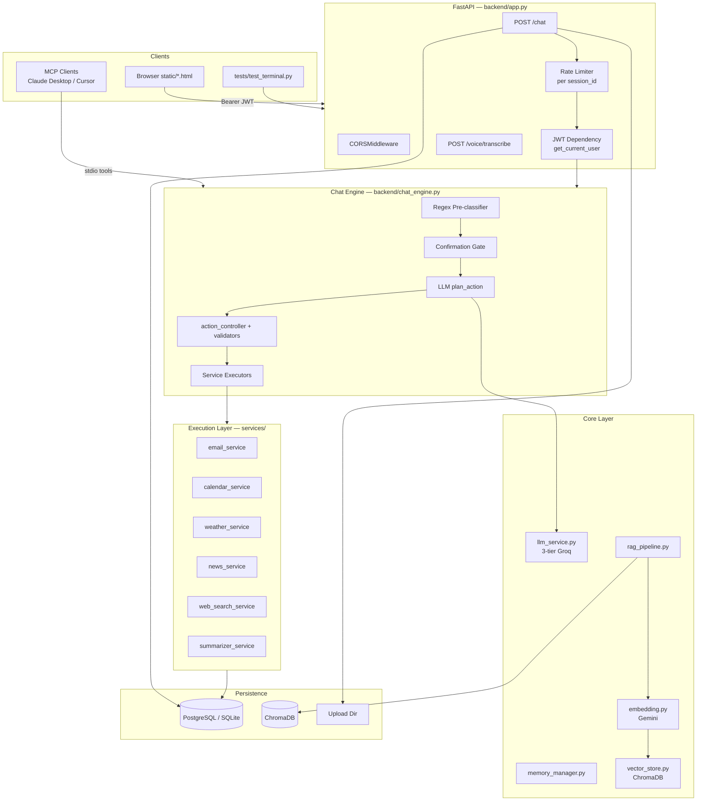
```mermaid
flowchart TB
    subgraph Clients
        WEB[Browser static/*.html]
        MCP[MCP Clients<br/>Claude Desktop / Cursor]
        TERM[tests/test_terminal.py]
    end

    subgraph API["FastAPI — backend/app.py"]
        CORS[CORSMiddleware]
        RL[Rate Limiter<br/>per session_id]
        AUTH[JWT Dependency<br/>get_current_user]
        CHAT["POST /chat"]
        VOICE["POST /voice/transcribe"]
    end

    subgraph Engine["Chat Engine — backend/chat_engine.py"]
        PRE[Regex Pre-classifier]
        CONF[Confirmation Gate]
        PLAN[LLM plan_action]
        VAL[action_controller + validators]
        EXEC[Service Executors]
    end

    subgraph Core["Core Layer"]
        LLM[llm_service.py<br/>3-tier Groq]
        RAG[rag_pipeline.py]
        MEM[memory_manager.py]
        EMB[embedding.py<br/>Gemini]
        VS[vector_store.py<br/>ChromaDB]
    end

    subgraph Services["Execution Layer — services/"]
        EM[email_service]
        CAL[calendar_service]
        WEA[weather_service]
        NEW[news_service]
        SRCH[web_search_service]
        SUM[summarizer_service]
    end

    subgraph Data["Persistence"]
        PG[(PostgreSQL / SQLite)]
        CHROMA[(ChromaDB)]
        UPLOADS[Upload Dir]
    end

    WEB -->|Bearer JWT| API
    MCP -->|stdio tools| Engine
    TERM --> API
    CHAT --> RL --> AUTH --> Engine
    PRE --> CONF --> PLAN --> VAL --> EXEC
    PLAN --> LLM
    RAG --> EMB --> VS
    EXEC --> Services
    Services --> PG
    CHAT --> PG
    RAG --> CHROMA
    CHAT --> UPLOADS
```


### Component responsibilities


| Layer      | Module                                            | Responsibility                                                     |
| ---------- | ------------------------------------------------- | ------------------------------------------------------------------ |
| Gateway    | `backend/app.py`                                  | Routes, CORS, rate limit, upload handling, lifespan (DB + KB init) |
| Auth       | `backend/auth.py`, `backend/google_auth.py`       | Register/login/JWT; per-user Google OAuth                          |
| Brain      | `backend/chat_engine.py`                          | Full message pipeline, multi-turn flows                            |
| Sessions   | `backend/session_store.py`                        | In-memory cache + DB message persistence                           |
| LLM        | `core/llm_service.py`                             | Tiered Groq calls, prompts, JSON planning                          |
| Validation | `core/validators.py`, `core/action_controller.py` | Anti-hallucination field checks                                    |
| RAG        | `core/rag_pipeline.py`, `core/ingestion.py`       | Ingest URLs, retrieve, synthesize                                  |
| MCP        | `mcp_server.py`                                   | FastMCP tools/resources/prompts                                    |


### Deployment architecture

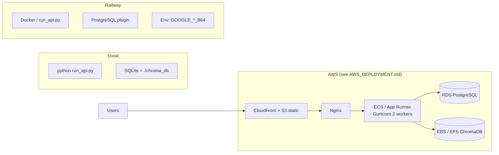
```mermaid
flowchart LR
    subgraph Local
        L1[python run_api.py]
        L2[SQLite + ./chroma_db]
    end

    subgraph Railway
        R1[Docker / run_api.py]
        R2[PostgreSQL plugin]
        R3[Env: GOOGLE_*_B64]
    end

    subgraph AWS["AWS (see AWS_DEPLOYMENT.md)"]
        CF[CloudFront + S3 static]
        NGX[Nginx]
        ECS[ECS / App Runner<br/>Gunicorn 2 workers]
        RDS[(RDS PostgreSQL)]
        EBS[(EBS / EFS ChromaDB)]
    end

    Users --> CF
    CF --> NGX --> ECS
    ECS --> RDS
    ECS --> EBS
```


---

## Request Lifecycle

End-to-end path for `POST /chat`:

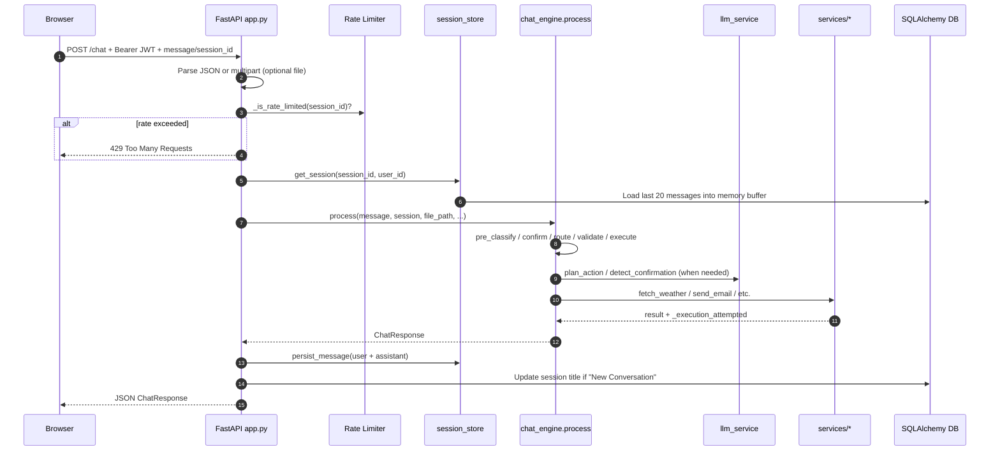
```mermaid
sequenceDiagram
    autonumber
    participant U as Browser
    participant A as FastAPI app.py
    participant RL as Rate Limiter
    participant SS as session_store
    participant CE as chat_engine.process
    participant LLM as llm_service
    participant SVC as services/*
    participant DB as SQLAlchemy DB

    U->>A: POST /chat + Bearer JWT + message/session_id
    A->>A: Parse JSON or multipart (optional file)
    A->>RL: _is_rate_limited(session_id)?
    alt rate exceeded
        A-->>U: 429 Too Many Requests
    end
    A->>SS: get_session(session_id, user_id)
    SS->>DB: Load last 20 messages into memory buffer
    A->>CE: process(message, session, file_path, ...)
    CE->>CE: pre_classify / confirm / route / validate / execute
    CE->>LLM: plan_action / detect_confirmation (when needed)
    CE->>SVC: fetch_weather / send_email / etc.
    SVC-->>CE: result + _execution_attempted
    CE-->>A: ChatResponse
    A->>SS: persist_message(user + assistant)
    A->>DB: Update session title if "New Conversation"
    A-->>U: JSON ChatResponse
```


---

## Workflow Engine

The chat engine (`backend/chat_engine.py`) implements an **8-step pipeline** (documented in module header):


| Step  | Name              | Behavior                                                                                                                          |
| ----- | ----------------- | --------------------------------------------------------------------------------------------------------------------------------- |
| **0** | Pre-classify      | `pre_classify_intent()` — regex for email/calendar/weather/news/search/greeting/cancel; clears stale pending on strong new intent |
| **1** | Confirmation gate | If `awaiting_confirmation` + pending action → `yes` executes, `no` cancels (regex + LLM `detect_confirmation` fallback)           |
| **—** | Resume collection | Pending email/calendar without awaiting → `handle_email_flow` / `handle_calendar_flow`                                            |
| **2** | Cancel / greeting | Hardcoded responses for cancel and capability queries (no LLM)                                                                    |
| **3** | Classify          | Regex intent or `plan_action()` (Tier PRIMARY) with last 6 turns + `selected_services`                                            |
| **4** | Route             | Dispatch to weather/news/search/summarize/email/calendar handlers                                                                 |
| **5** | Validate          | `validate_action()` — strip fabricated emails, check required fields                                                              |
| **6** | Collect fields    | Multi-turn `collect_missing_fields()` — one question at a time                                                                    |
| **7** | Preview + confirm | Email/calendar preview → `status: awaiting` → user must confirm                                                                   |
| **8** | Execute           | `execute_confirmed_action()` — real API only after `yes`                                                                          |


### Pipeline flowchart

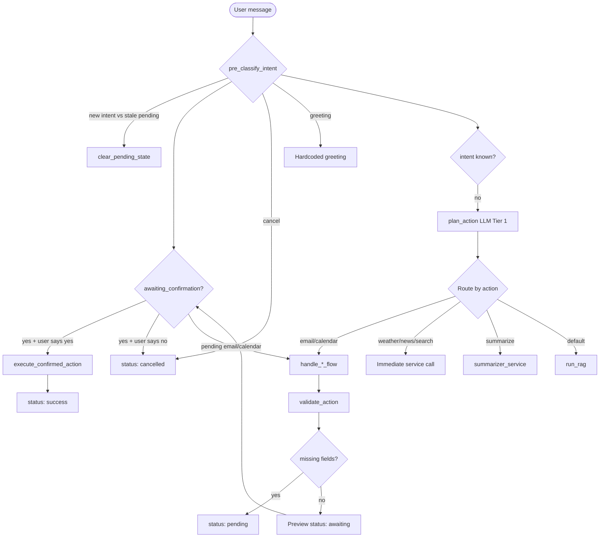
```mermaid
flowchart TD
    START([User message]) --> S0{pre_classify_intent}
    S0 -->|new intent vs stale pending| CLR[clear_pending_state]
    S0 --> S1{awaiting_confirmation?}
    S1 -->|yes + user says yes| EXEC[execute_confirmed_action]
    S1 -->|yes + user says no| CAN[status: cancelled]
    S1 -->|pending email/calendar| FLOW[handle_*_flow]
    S0 -->|cancel| CAN
    S0 -->|greeting| GREET[Hardcoded greeting]
    S0 --> S3{intent known?}
    S3 -->|no| PLAN[plan_action LLM Tier 1]
    PLAN --> S4{Route by action}
    S4 -->|email/calendar| FLOW
    S4 -->|weather/news/search| DIRECT[Immediate service call]
    S4 -->|summarize| SUM[summarizer_service]
    S4 -->|default| RAG[run_rag]
    FLOW --> S5[validate_action]
    S5 --> S6{missing fields?}
    S6 -->|yes| ASK[status: pending]
    S6 -->|no| PREV[Preview status: awaiting]
    PREV --> S1
    EXEC --> OK[status: success]
```


### Response status model


| `status`    | Meaning                           | Typical `action`                 |
| ----------- | --------------------------------- | -------------------------------- |
| `success`   | Completed                         | `weather`, `email`, `rag`, …     |
| `pending`   | Collecting fields                 | `email`, `calendar`, `summarize` |
| `awaiting`  | Preview shown; needs confirmation | `email`, `calendar`              |
| `cancelled` | User aborted                      | `none`                           |
| `error`     | Validation or API failure         | any                              |


---

## AI Pipeline

### 3-tier Groq LLM routing

Splits LLM calls across three API keys to maximize free-tier quotas and isolate workloads.

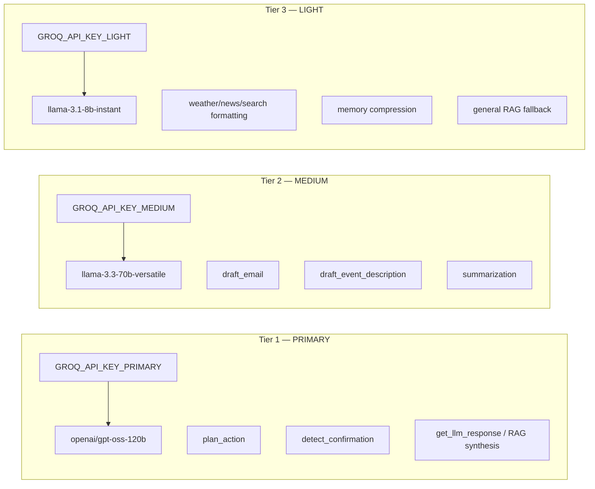
```mermaid
flowchart LR
    subgraph T1["Tier 1 — PRIMARY"]
        K1[GROQ_API_KEY_PRIMARY]
        M1[openai/gpt-oss-120b]
        T1A[plan_action]
        T1B[detect_confirmation]
        T1C[get_llm_response / RAG synthesis]
    end

    subgraph T2["Tier 2 — MEDIUM"]
        K2[GROQ_API_KEY_MEDIUM]
        M2[llama-3.3-70b-versatile]
        T2A[draft_email]
        T2B[draft_event_description]
        T2C[summarization]
    end

    subgraph T3["Tier 3 — LIGHT"]
        K3[GROQ_API_KEY_LIGHT]
        M3[llama-3.1-8b-instant]
        T3A[weather/news/search formatting]
        T3B[memory compression]
        T3C[general RAG fallback]
    end

    K1 --> M1
    K2 --> M2
    K3 --> M3
```


| Tier        | Model (default)           | Daily budget role      | Functions                                             |
| ----------- | ------------------------- | ---------------------- | ----------------------------------------------------- |
| **PRIMARY** | `openai/gpt-oss-120b`     | Reasoning-critical     | `plan_action`, `detect_confirmation`, RAG when KB hit |
| **MEDIUM**  | `llama-3.3-70b-versatile` | Writing + long context | `draft_email`, calendar descriptions, summarize       |
| **LIGHT**   | `llama-3.1-8b-instant`    | High-volume cheap      | Formatting, buffer compression, conversational RAG    |


**Fallback:** unset `MEDIUM`/`LIGHT` keys → PRIMARY; on `RateLimitError` → retry PRIMARY before user-facing limit message.

### Structured planning (no native tool-calling)

`plan_action()` returns JSON like `{ "action": "email", "arguments": { ... } }`. Python parses and validates independently — the model never invokes external tools directly.

### Context management


| Mechanism         | Implementation                                                           |
| ----------------- | ------------------------------------------------------------------------ |
| Short-term buffer | Last 10 turns in `ConversationMemory`                                    |
| Compression       | When buffer ≥ 30 messages, oldest half summarized via Tier LIGHT         |
| DB hydration      | On session load, last 20 DB messages replayed into buffer                |
| RAG context       | KB chunks + `get_context_block()` injected into system prompt            |
| `last_result`     | Weather/news/search stored on session for “use that data in email” flows |


---

## RAG System

### Architecture

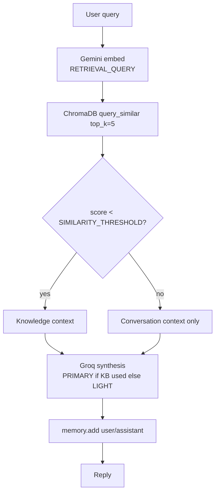
```mermaid
flowchart TD
    Q[User query] --> EMBQ[Gemini embed<br/>RETRIEVAL_QUERY]
    EMBQ --> CHROMA[ChromaDB query_similar top_k=5]
    CHROMA --> THRESH{score < SIMILARITY_THRESHOLD?}
    THRESH -->|yes| CTX[Knowledge context]
    THRESH -->|no| CONV[Conversation context only]
    CTX --> LLM[Groq synthesis<br/>PRIMARY if KB used else LIGHT]
    CONV --> LLM
    LLM --> MEM[memory.add user/assistant]
    MEM --> OUT[Reply]
```


| Stage                       | Detail                                                                                                                             |
| --------------------------- | ---------------------------------------------------------------------------------------------------------------------------------- |
| **Ingestion**               | `ingest_urls()` — BeautifulSoup extract → `chunk_text(500, overlap 100)` → Gemini `RETRIEVAL_DOCUMENT` embeddings → ChromaDB store |
| **Startup**                 | `initialize_knowledge_base()` in app lifespan — seeds `DEFAULT_URLS` if collection empty                                           |
| **Retrieval**               | Cosine distance in Chroma; lower distance = more similar; filter `score < SIMILARITY_THRESHOLD` (default `0.45`)                   |
| **Synthesis**               | Tier PRIMARY when KB context present; Tier LIGHT for pure conversation                                                             |
| **Hallucination reduction** | Answers grounded in retrieved chunks; capability queries short-circuit without LLM                                                 |


### Embedding configuration

```python
# core/embedding.py — requires GEMINI_API_KEY
model = "models/text-embedding-004"  # 768 dimensions
task_type = "RETRIEVAL_DOCUMENT" | "RETRIEVAL_QUERY"
```

> **Note:** Embeddings use the **Gemini API** (cloud, no local `sentence-transformers`). This shrinks Docker images from ~2GB to ~300MB.

---

## MCP Server

**Entry:** `python run_mcp.py` → stdio transport via FastMCP.

### Tool surface (9 tools)


| Tool                 | Type                              | Confirmation required |
| -------------------- | --------------------------------- | --------------------- |
| `chat`               | Master brain — routes all intents | For email/calendar    |
| `weather_service`    | Direct API                        | No                    |
| `web_search_service` | Direct API                        | No                    |
| `summarizer_service` | URL / text / file_path            | No                    |
| `email_service`      | Full workflow via `process()`     | Yes                   |
| `calendar_service`   | Full workflow via `process()`     | Yes                   |
| `news_service`       | Routed via `process()`            | No                    |
| `reset_conversation` | Clears `mcp-server` session       | —                     |
| `get_system_status`  | JSON health of all services       | —                     |


### MCP communication

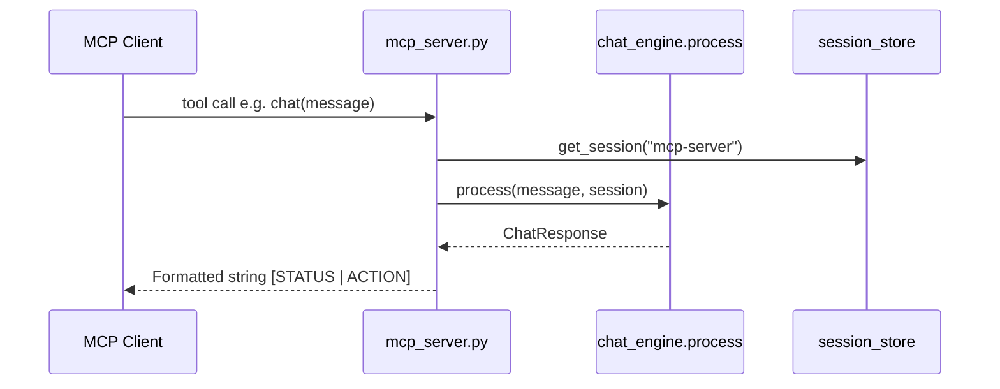
```mermaid
sequenceDiagram
    participant C as MCP Client
    participant M as mcp_server.py
    participant CE as chat_engine.process
    participant S as session_store

    C->>M: tool call e.g. chat(message)
    M->>S: get_session("mcp-server")
    M->>CE: process(message, session)
    CE-->>M: ChatResponse
    M-->>C: Formatted string [STATUS | ACTION]
```


### Resources & prompts


| URI                 | Purpose                        |
| ------------------- | ------------------------------ |
| `config://settings` | Runtime configuration snapshot |
| `kb://status`       | ChromaDB document count        |
| `help://guide`      | Full tool usage JSON           |


**Prompts:** `compose_email`, `schedule_event`, `search_web`, `get_weather`, `summarize_url`, `get_news`, `ask_question`

### Claude Desktop configuration

```json
{
  "mcpServers": {
    "ai-action-assistant": {
      "command": "C:\\path\\to\\python.exe",
      "args": ["run_mcp.py"],
      "cwd": "C:\\path\\to\\ai-action-assistant"
    }
  }
}
```

Windows config path: `%APPDATA%\Claude\claude_desktop_config.json`

### MCP Inspector

```bash
npx @modelcontextprotocol/inspector python run_mcp.py
# Open http://localhost:5173
```

---

## Security

### JWT authentication flow

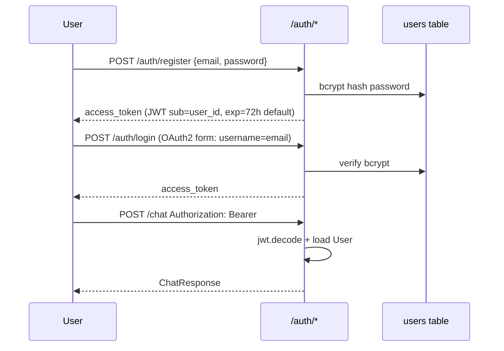
```mermaid
sequenceDiagram
    participant U as User
    participant API as /auth/*
    participant DB as users table

    U->>API: POST /auth/register {email, password}
    API->>DB: bcrypt hash password
    API-->>U: access_token (JWT sub=user_id, exp=72h default)

    U->>API: POST /auth/login (OAuth2 form: username=email)
    API->>DB: verify bcrypt
    API-->>U: access_token

    U->>API: POST /chat Authorization: Bearer
    API->>API: jwt.decode + load User
    API-->>U: ChatResponse
```


| Control          | Implementation                                                                     |
| ---------------- | ---------------------------------------------------------------------------------- |
| Password storage | bcrypt via `_hash_password()`                                                      |
| Token            | HS256 JWT — `JWT_SECRET_KEY`, `JWT_EXPIRE_HOURS`                                   |
| Protected routes | `Depends(get_current_user)` on `/chat`, `/reset`, `/sessions`, `/voice/transcribe` |
| Google OAuth     | Per-user tokens in `google_tokens`; scopes: calendar + gmail.send                  |
| CORS             | `ALLOWED_ORIGINS` comma-separated; credentials allowed                             |
| Rate limiting    | 30 req / 60s per `session_id` (in-memory; see Scalability)                         |
| Upload safety    | Extension whitelist, UUID filenames, `UPLOAD_MAX_BYTES`                            |
| Production docs  | Swagger disabled when `IS_PRODUCTION`                                              |
| Container        | Non-root `appuser` in Dockerfile                                                   |


### Per-user Google OAuth routes


| Method   | Endpoint                  | Description                 |
| -------- | ------------------------- | --------------------------- |
| `GET`    | `/auth/google/connect`    | Start OAuth redirect        |
| `GET`    | `/auth/google/callback`   | Save token to `GoogleToken` |
| `GET`    | `/auth/google/status`     | Connection status           |
| `DELETE` | `/auth/google/disconnect` | Remove token                |


---

## Anti-Hallucination System

Layered defenses beyond “prompt engineering”:

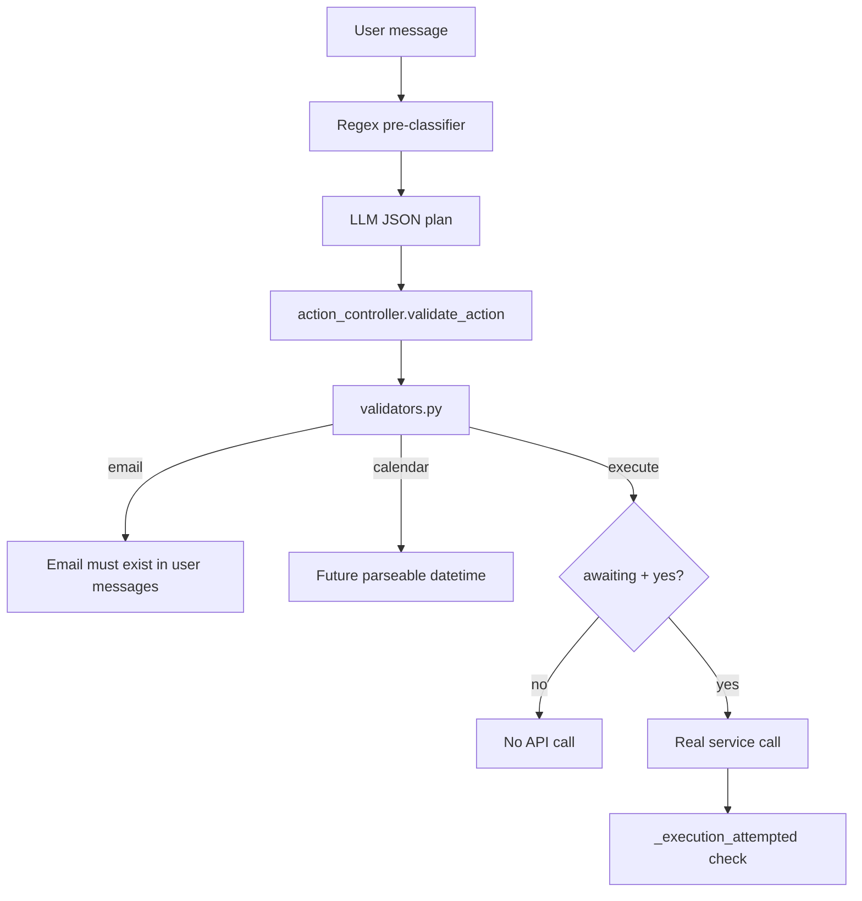
```mermaid
flowchart TD
    MSG[User message] --> PRE[Regex pre-classifier]
    PRE --> PLAN[LLM JSON plan]
    PLAN --> AC[action_controller.validate_action]
    AC --> V[validators.py]
    V -->|email| EV[Email must exist in user messages]
    V -->|calendar| DV[Future parseable datetime]
    V -->|execute| GATE{awaiting + yes?}
    GATE -->|no| BLOCK[No API call]
    GATE -->|yes| API[Real service call]
    API --> CHK[_execution_attempted check]
```


| Layer              | File                                  | What it prevents                          |
| ------------------ | ------------------------------------- | ----------------------------------------- |
| Email provenance   | `validators.validate_email_address`   | LLM-invented recipients                   |
| Datetime sanity    | `validators.validate_datetime_phrase` | Past/invalid dates                        |
| Placeholder bodies | `validators.validate_email_body`      | `[INSERT ...]` template leakage           |
| Field stripping    | `validate_email_action`               | Removes invalid `to` lists entirely       |
| Execution guard    | `_require_real_execution`             | Fake success without API                  |
| No LLM tool-use    | Architecture                          | Model cannot call Gmail/Calendar directly |


---

## Frontend Architecture

### Pages


| File                    | Route         | Purpose                          |
| ----------------------- | ------------- | -------------------------------- |
| `static/login.html`     | `/`, `/login` | Sign-in; redirect if JWT present |
| `static/signup.html`    | `/signup`     | Registration                     |
| `static/dashboard.html` | `/dashboard`  | Chat UI (JWT required)           |
| `static/profile.html`   | `/profile`    | Profile edit (`PATCH /auth/me`)  |
| `static/about.html`     | `/about`      | Product info                     |


### Client-side behavior


| Concern         | Implementation                                                       |
| --------------- | -------------------------------------------------------------------- |
| Auth token      | `localStorage` key for JWT; `Authorization: Bearer` on API calls     |
| Session ID      | Client-generated UUID per conversation; sent as `session_id`         |
| Chat history    | Sidebar + `localStorage` metadata; server persists messages in DB    |
| File upload     | Multipart `POST /chat` with `file` field; drag-and-drop on dashboard |
| Confirmation UX | Inline Confirm/Cancel when `status === "awaiting"`                   |
| Service chips   | `selected_services` JSON — biases LLM planner                        |
| Responsive      | Sidebar hidden below 680px width                                     |


### Auth flow

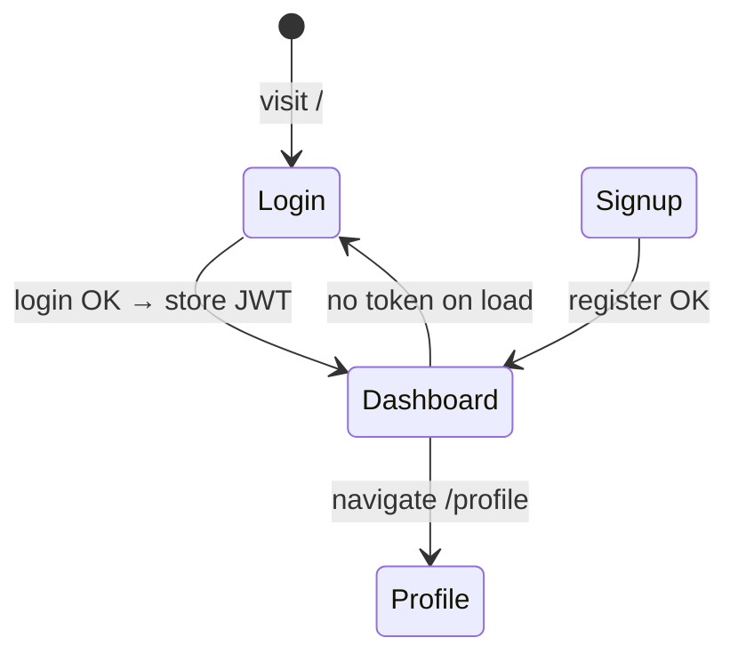
```mermaid
stateDiagram-v2
    [*] --> Login: visit /
    Login --> Dashboard: login OK → store JWT
    Dashboard --> Login: no token on load
    Signup --> Dashboard: register OK
    Dashboard --> Profile: navigate /profile
```


---

## Folder Structure

```
ai-action-assistant/
│
├── backend/
│   ├── app.py              # FastAPI app, routes, middleware, lifespan
│   ├── auth.py             # JWT register/login/me/profile
│   ├── google_auth.py      # Per-user Google OAuth
│   ├── chat_engine.py      # 8-step message pipeline
│   ├── session_store.py    # Session cache + DB persistence
│   └── schemas.py          # Pydantic ChatRequest/ChatResponse
│
├── core/
│   ├── action_controller.py
│   ├── embedding.py        # Gemini embeddings
│   ├── ingestion.py        # URL → ChromaDB
│   ├── intent_parser.py
│   ├── llm_service.py      # 3-tier Groq
│   ├── memory_manager.py
│   ├── rag_pipeline.py
│   ├── validators.py
│   └── vector_store.py
│
├── db/
│   ├── database.py
│   └── models.py           # User, GoogleToken, ChatSession, Message
│
├── services/
│   ├── calendar_service.py
│   ├── email_service.py
│   ├── news_service.py
│   ├── summarizer_service.py
│   ├── voice_service.py
│   ├── weather_service.py
│   └── web_search_service.py
│
├── static/                 # login, signup, dashboard, profile, about
├── scripts/
│   ├── calendar_auth.py    # Local Google OAuth setup
│   ├── encode_token.py     # Base64 for cloud env
│   └── startup.py          # Decode GOOGLE_*_B64 on Railway/AWS
├── tests/
│   ├── test_mcp.py
│   └── test_terminal.py
│
├── mcp_server.py
├── config.py
├── run_api.py              # Dev: Uvicorn
├── run_mcp.py
├── Dockerfile              # Prod: Gunicorn + 2 workers
├── apprunner.yaml          # AWS App Runner
├── ecs-task-definition.json
├── nginx.conf
├── AWS_DEPLOYMENT.md       # Full AWS guide
├── TEST_CHECKLIST.md       # Manual QA matrix
├── requirements.txt
└── .env.example
```

---

## Quick Start

```bash
python run_api.py          # API → http://localhost:8000
python run_mcp.py            # MCP → stdio (Claude Desktop / Cursor)
```


| URL                               | Description          |
| --------------------------------- | -------------------- |
| `http://localhost:8000`           | Login (entry)        |
| `http://localhost:8000/signup`    | Create account       |
| `http://localhost:8000/dashboard` | Chat (JWT required)  |
| `http://localhost:8000/docs`      | Swagger (local only) |
| `http://localhost:8000/health`    | Health check         |


---

## Local Development

### Prerequisites

- Python 3.10+
- [Groq API key](https://console.groq.com) — `GROQ_API_KEY_PRIMARY`
- [Gemini API key](https://aistudio.google.com/app/apikey) — `GEMINI_API_KEY` (embeddings)
- Google Cloud project — **Gmail API** + **Google Calendar API** enabled
- [NewsAPI](https://newsapi.org) and [OpenWeatherMap](https://openweathermap.org/api) keys (optional for those features)

### Setup

```bash
git clone https://github.com/YOUR_USERNAME/ai-action-assistant.git
cd ai-action-assistant

python -m venv venv
# Windows: venv\Scripts\activate
# macOS/Linux: source venv/bin/activate

pip install -r requirements.txt
cp .env.example .env
# Edit .env — minimum: GROQ_API_KEY_PRIMARY, GEMINI_API_KEY, JWT_SECRET_KEY
```

### Google OAuth (local)

```bash
# Place credentials.json in project root
python scripts/calendar_auth.py
# Browser flow → token.pickle
```

### Run

```bash
python run_api.py
# Visit http://localhost:8000 → sign up → chat
```

---

## Environment Variables


| Variable                           | Required         | Default                           | Description                                    |
| ---------------------------------- | ---------------- | --------------------------------- | ---------------------------------------------- |
| `GROQ_API_KEY_PRIMARY`             | **Yes**          | —                                 | Tier 1 — intent, RAG, confirmation             |
| `GROQ_MODEL_PRIMARY`               | No               | `openai/gpt-oss-120b`             | Tier 1 model                                   |
| `GROQ_API_KEY_MEDIUM`              | No               | → PRIMARY                         | Tier 2 — email, summarize                      |
| `GROQ_MODEL_MEDIUM`                | No               | `llama-3.3-70b-versatile`         | Tier 2 model                                   |
| `GROQ_API_KEY_LIGHT`               | No               | → PRIMARY                         | Tier 3 — formatting, compression               |
| `GROQ_MODEL_LIGHT`                 | No               | `llama-3.1-8b-instant`            | Tier 3 model                                   |
| `GROQ_API_KEY`                     | No               | → PRIMARY                         | Legacy single-key alias                        |
| `GEMINI_API_KEY`                   | **Yes**          | —                                 | Embeddings (`text-embedding-004`)              |
| `EMAIL_USER`                       | For shared Gmail | —                                 | Legacy From address (per-user OAuth preferred) |
| `NEWS_API_KEY`                     | For news         | —                                 | NewsAPI.org                                    |
| `OPENWEATHER_API_KEY`              | For weather      | —                                 | OpenWeatherMap                                 |
| `GOOGLE_CREDENTIALS_FILE`          | Local            | `credentials.json`                | OAuth client                                   |
| `GOOGLE_TOKEN_FILE`                | Local            | `token.pickle`                    | Shared token (legacy)                          |
| `GOOGLE_CLIENT_ID` / `SECRET`      | OAuth web flow   | —                                 | Per-user connect                               |
| `CALENDAR_TIMEZONE`                | No               | `Asia/Kolkata`                    | Calendar event TZ                              |
| `CHROMA_DB_DIR` / `CHROMA_DB_PATH` | No               | `./chroma_db` or `/app/chroma_db` | Vector store path                              |
| `UPLOAD_DIR`                       | No               | `./uploads` or `/tmp/uploads`     | Uploaded files                                 |
| `SIMILARITY_THRESHOLD`             | No               | `0.45`                            | RAG distance cutoff                            |
| `RATE_LIMIT_REQUESTS`              | No               | `30`                              | Max requests per session per window            |
| `RATE_LIMIT_WINDOW_SECONDS`        | No               | `60`                              | Rate limit window                              |
| `UPLOAD_MAX_BYTES`                 | No               | `10485760`                        | 10 MB max upload                               |
| `UPLOAD_MAX_AGE_SECONDS`           | No               | `3600`                            | Upload cleanup age                             |
| `ALLOWED_ORIGINS`                  | No               | localhost ports                   | CORS origins                                   |
| `DATABASE_URL`                     | No               | SQLite file                       | PostgreSQL on cloud                            |
| `JWT_SECRET_KEY`                   | **Prod**         | insecure default                  | JWT signing secret                             |
| `JWT_EXPIRE_HOURS`                 | No               | `72`                              | Token lifetime                                 |
| `GOOGLE_TOKEN_B64`                 | Cloud            | —                                 | Encoded `token.pickle`                         |
| `GOOGLE_CREDENTIALS_B64`           | Cloud            | —                                 | Encoded `credentials.json`                     |
| `ENVIRONMENT`                      | No               | —                                 | Set `production` for prod behavior             |
| `WHISPER_MODEL`                    | No               | `whisper-large-v3-turbo`          | STT model                                      |
| `LOG_DIR`                          | No               | `./logs` or `/app/logs`           | Rotating file logs                             |


**3-tier .env example**

```env
GROQ_API_KEY_PRIMARY=your_primary_key
GROQ_MODEL_PRIMARY=openai/gpt-oss-120b

GROQ_API_KEY_MEDIUM=your_medium_key
GROQ_MODEL_MEDIUM=llama-3.3-70b-versatile

GROQ_API_KEY_LIGHT=your_light_key
GROQ_MODEL_LIGHT=llama-3.1-8b-instant

GEMINI_API_KEY=your_gemini_key
JWT_SECRET_KEY=your-long-random-secret
```

---

## API Reference

### Auth


| Method  | Endpoint         | Auth | Description                                      |
| ------- | ---------------- | ---- | ------------------------------------------------ |
| `POST`  | `/auth/register` | —    | `{ email, password, name? }` → JWT               |
| `POST`  | `/auth/login`    | —    | OAuth2 form (`username`=email, `password`) → JWT |
| `GET`   | `/auth/me`       | JWT  | Current user profile                             |
| `PATCH` | `/auth/me`       | JWT  | Update name, bio, avatar_url                     |


### Google OAuth


| Method   | Endpoint                  | Auth | Description                |
| -------- | ------------------------- | ---- | -------------------------- |
| `GET`    | `/auth/google/connect`    | JWT  | Redirect to Google consent |
| `GET`    | `/auth/google/callback`   | —    | OAuth callback             |
| `GET`    | `/auth/google/status`     | JWT  | Linked account status      |
| `DELETE` | `/auth/google/disconnect` | JWT  | Revoke stored token        |


### Chat & system


| Method | Endpoint            | Auth | Description                      |
| ------ | ------------------- | ---- | -------------------------------- |
| `POST` | `/chat`             | JWT  | Main chat — JSON or multipart    |
| `POST` | `/reset`            | JWT  | `{ session_id }` — clear session |
| `GET`  | `/sessions`         | JWT  | List user's chat sessions        |
| `GET`  | `/health`           | —    | Health + KB doc count            |
| `POST` | `/voice/transcribe` | JWT  | Audio → text (Groq Whisper)      |


### Chat request (JSON)

```json
{
  "message": "What is the weather in Mumbai?",
  "session_id": "uuid-string",
  "selected_services": ["weather"]
}
```

### Chat request (multipart + file)

```
POST /chat
Content-Type: multipart/form-data

message=Summarize this document
session_id=uuid-string
file=<binary PDF|DOCX|XLSX|TXT>
```

### Chat response

```json
{
  "status": "success",
  "action": "weather",
  "message": "Current weather in Mumbai: 32°C, Humid...",
  "session_id": "uuid-string",
  "preview": null,
  "news_articles": null
}
```

**Status values:** `success` | `error` | `pending` | `awaiting` | `cancelled`

---

## Database Schema

```mermaid
erDiagram
    users ||--o{ sessions : owns
    users ||--o| google_tokens : has
    sessions ||--o{ messages : contains

    users {
        string id PK
        string email UK
        string password
        string name
        string avatar_url
        string bio
        datetime created_at
        bool is_active
    }

    google_tokens {
        string id PK
        string user_id FK UK
        text token_data
        string email
        datetime created_at
        datetime updated_at
    }

    sessions {
        string id PK
        string user_id FK
        string title
        datetime created_at
        datetime updated_at
    }

    messages {
        int id PK
        string session_id FK
        string role
        text content
        datetime created_at
    }
```


| Table           | Purpose                                           |
| --------------- | ------------------------------------------------- |
| `users`         | Accounts with bcrypt passwords                    |
| `google_tokens` | Per-user pickled OAuth credentials (base64 in DB) |
| `sessions`      | Chat sessions per user                            |
| `messages`      | Persistent `user` / `assistant` turns             |


**Local:** SQLite (default). **Cloud:** set `DATABASE_URL=postgresql://...`

---

## File Upload Flow

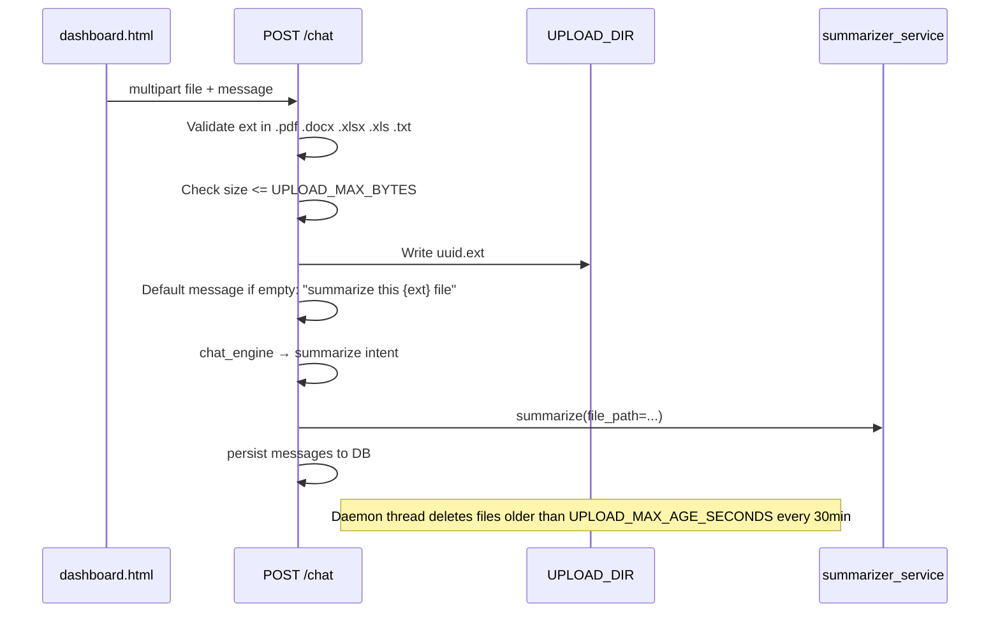
```mermaid
sequenceDiagram
    participant UI as dashboard.html
    participant API as POST /chat
    participant FS as UPLOAD_DIR
    participant SUM as summarizer_service

    UI->>API: multipart file + message
    API->>API: Validate ext in .pdf .docx .xlsx .xls .txt
    API->>API: Check size <= UPLOAD_MAX_BYTES
    API->>FS: Write uuid.ext
    API->>API: Default message if empty: "summarize this {ext} file"
    API->>API: chat_engine → summarize intent
    API->>SUM: summarize(file_path=...)
    API->>API: persist messages to DB
    Note over FS: Daemon thread deletes files older than UPLOAD_MAX_AGE_SECONDS every 30min
```


---

## Deployment


| Target      | Entry                   | Docs                                     |
| ----------- | ----------------------- | ---------------------------------------- |
| **Docker**  | `Dockerfile` → Gunicorn | [Docker](#docker)                        |
| **Railway** | `run_api.py` or Docker  | [Railway](#railway)                      |
| **AWS**     | EC2 / ECS / App Runner  | [AWS_DEPLOYMENT.md](./AWS_DEPLOYMENT.md) |


### Live demo URLs

Replace after deploy:

- App: `https://your-app.up.railway.app` or your AWS domain  
- Docs: `https://your-domain/docs` (non-production only)  
- Health: `https://your-domain/health`

---

## Docker

Production image uses **Python 3.11-slim**, non-root user, and Gunicorn:

```dockerfile
# Dockerfile (summary)
CMD gunicorn -k uvicorn.workers.UvicornWorker backend.app:app \
     --bind 0.0.0.0:8000 --workers 2 --timeout 120
HEALTHCHECK curl -f http://localhost:8000/health
```

```bash
docker build -t ai-action-assistant .
docker run -d -p 8000:8000 --env-file .env \
  -v ./chroma_db:/app/chroma_db \
  ai-action-assistant
```

---

## Railway

1. Push repo to GitHub; connect at [railway.app](https://railway.app).
2. Use Dockerfile or `python run_api.py` with `PORT` injected.
3. Add PostgreSQL plugin → set `DATABASE_URL`.
4. Encode Google credentials:

```bash
python scripts/encode_token.py
python -c "import base64; print(base64.b64encode(open('credentials.json','rb').read()).decode())"
```

1. Set in Railway dashboard:

```
GROQ_API_KEY_PRIMARY
GEMINI_API_KEY
JWT_SECRET_KEY
DATABASE_URL
GOOGLE_TOKEN_B64
GOOGLE_CREDENTIALS_B64
NEWS_API_KEY
OPENWEATHER_API_KEY
EMAIL_USER
```

`scripts/startup.py` decodes `GOOGLE_*_B64` when `RAILWAY_ENVIRONMENT` is set.

---

## AWS

Full guide: **[AWS_DEPLOYMENT.md](./AWS_DEPLOYMENT.md)**

Summary topology:

- **CloudFront + S3** — static frontend (optional split)  
- **EC2 / ECS / App Runner** — FastAPI container behind Nginx  
- **RDS PostgreSQL** — users, sessions, messages, google_tokens  
- **EBS / EFS** — persistent ChromaDB at `CHROMA_DB_PATH=/data/chromadb`

Also provided: `apprunner.yaml`, `ecs-task-definition.json`, `nginx.conf`

---

## Monitoring & Logging


| Signal     | Source                                                              |
| ---------- | ------------------------------------------------------------------- |
| Health     | `GET /health` — `status`, `kb_docs`, `environment`, `startup_error` |
| MCP health | `get_system_status` tool — per-service readiness                    |
| Logs       | `config.setup_logging()` — stdout + rotating `app.log` (10MB × 5)   |
| Level      | `DEBUG` local, `INFO` production                                    |
| Container  | Docker `HEALTHCHECK` → `/health`                                    |


**Production checklist:** set `JWT_SECRET_KEY`, restrict `ALLOWED_ORIGINS`, use PostgreSQL, mount persistent Chroma path, connect real Google OAuth per user or shared B64 tokens.

---

## Scalability


| Area          | Current design              | Scale-out note                                              |
| ------------- | --------------------------- | ----------------------------------------------------------- |
| API workers   | Gunicorn `--workers 2`      | Increase workers; mind in-memory rate limit + session cache |
| Rate limiting | Per-process `defaultdict`   | Replace with Redis for multi-instance                       |
| Session cache | `_cache` in `session_store` | Sticky sessions or Redis                                    |
| ChromaDB      | Single persistent path      | EFS/EBS shared volume or managed vector DB                  |
| LLM           | 3-key tiering               | Add keys before horizontal scale                            |
| DB            | PostgreSQL-ready            | Connection pooling (e.g. PgBouncer) at high load            |


---

## Performance Optimization

- **Regex pre-classifier** — skips LLM for obvious intents (~200ms+ saved).
- **Tier LIGHT** for formatting and memory compression — preserves PRIMARY quota.
- **Gemini embeddings** — no local torch/sentence-transformers in container.
- **Lazy session DB load** — only last 20 messages on first access.
- **KB init once** — lifespan `initialize_knowledge_base()` if empty.
- **RAG tier selection** — PRIMARY only when KB chunks match threshold.

---

## Testing

### Terminal client

```bash
python tests/test_terminal.py
```

### MCP suite

```bash
python tests/test_mcp.py
python tests/test_mcp.py --tool weather_service
python tests/test_mcp.py --tool get_system_status
```

### Manual QA

See **[TEST_CHECKLIST.md](./TEST_CHECKLIST.md)** — 10+ scenarios (greeting, email auto-generate, calendar, cancel, stale-state override, anti-hallucination).

### Health

```bash
curl http://localhost:8000/health
```

---

## Troubleshooting


| Symptom                            | Likely cause                                       | Fix                                                   |
| ---------------------------------- | -------------------------------------------------- | ----------------------------------------------------- |
| Startup `EnvironmentError`         | Missing `GROQ_API_KEY_PRIMARY` or `GEMINI_API_KEY` | Set keys in `.env`                                    |
| `degraded` health                  | `config.validate()` failed at lifespan             | Check logs for `startup_error`                        |
| Email fails “Google not connected” | No per-user token                                  | Dashboard → Connect Google → `/auth/google/connect`   |
| Empty RAG answers                  | Chroma empty                                       | Restart API (ingests `DEFAULT_URLS`) or run ingestion |
| 429 on chat                        | Rate limit                                         | Wait 60s or raise `RATE_LIMIT_REQUESTS`               |
| LLM “token limit” message          | Groq quota                                         | Add MEDIUM/LIGHT keys or wait for reset               |
| Upload rejected                    | Wrong extension / size                             | Use PDF/DOCX/XLSX/TXT under 10MB                      |
| CORS error from frontend           | Origin not allowed                                 | Add URL to `ALLOWED_ORIGINS`                          |
| Calendar wrong TZ                  | Config                                             | Set `CALENDAR_TIMEZONE`                               |


---

## Roadmap


| Phase   | Feature                                    | Status                             |
| ------- | ------------------------------------------ | ---------------------------------- |
| Phase 1 | Agent orchestrator layer                   | Planned                            |
| Phase 2 | `BaseTool` tool framework                  | Planned                            |
| Phase 3 | Streaming responses (SSE)                  | Planned                            |
| Phase 4 | Redis session + rate limit store           | Planned                            |
| Phase 5 | Horizontal multi-instance hardening        | Planned                            |
| Phase 6 | Full voice UI (Whisper + TTS in dashboard) | Partial (`/voice/transcribe` live) |


---

## Development Journey

This project went through **9 complete rebuilds** before production stability:


| Rebuild | Focus                                                  |
| ------- | ------------------------------------------------------ |
| 1–3     | Separating LLM reasoning from Python execution         |
| 4–5     | Multi-turn field collection + session state            |
| 6–7     | Anti-hallucination validation (emails, dates)          |
| 8       | Confirmation gate architecture                         |
| 9       | MCP + auth + rate limiting + DB + Docker + cloud paths |


---

## Contributing

1. Fork the repository and create a feature branch.
2. Follow existing patterns: validators before execution, no LLM tool-calling.
3. Run `python tests/test_mcp.py` and relevant items from `TEST_CHECKLIST.md`.
4. Keep secrets out of commits (`.env`, `credentials.json`, `token.pickle`).
5. Open a PR with a clear description of pipeline or API changes.

---

## License

MIT License — see [LICENSE](./LICENSE).

---

## Credits

**Yash** — Infopulse Tech  

Built as a production-grade AI engineering project demonstrating agentic system design: planner–validator–executor separation, MCP integration, and cloud-ready deployment.

---

**Appendix — Google Stitch UI generation prompt**

Use in [Google Stitch](https://stitch.withgoogle.com) to regenerate UI assets:

```
Build a production-grade AI assistant web application UI with three separate pages.

Design system:
- Dark theme only. Background: #0a0a0a. Surface: #111111. Border: #222222.
- Accent color: #10a37f (green). Danger: #ef4444. Warning: #f59e0b. Info: #3b82f6.
- Typography: "Instrument Sans" for UI text, "Geist Mono" for labels, badges, and code.
- Border radius: 8px for inputs/buttons, 14px for cards, 16px for modals.
- No gradients. No shadows. Flat, minimal, terminal-inspired aesthetic.

PAGE 1 — Login (/login)
- Centered card (max-width 400px) on dark background.
- Logo mark: 38x38px green rounded square with "AI" in monospace white.
- Logo text: "AI Action Assistant" + subtitle "PRODUCTION · RAILWAY" in muted monospace.
- Heading: "Welcome back" (22px, semibold).
- Subtitle: "Sign in to your account to continue" (13px, muted).
- Two fields: Email (type=email) and Password (type=password). Labels in uppercase monospace.
- Primary button: full-width, green background, "Sign In".
- Error state: dark red background box with red border and red text.
- Footer link: "Don't have an account? Create one" linking to /signup.
- On load: if JWT token exists in localStorage, redirect to /dashboard.

PAGE 2 — Signup (/signup)
- Same card layout as login.
- Heading: "Create account". Subtitle: "Start using your personal AI assistant".
- Three fields: Full Name (optional), Email, Password (min 8 chars with hint text).
- Primary button: "Create Account".
- Footer link: "Already have an account? Sign in" linking to /login.
- On load: if JWT token exists in localStorage, redirect to /dashboard.

PAGE 3 — Dashboard (/dashboard)
- Full-screen two-column layout: fixed sidebar (260px) + main chat area (flex: 1).
- On load: if no JWT token in localStorage, redirect to /login.

SIDEBAR:
- Top section: logo + "New conversation" button (secondary style, full width).
- Service selector grid (2 columns, 6 items): Weather, News, Web Search, Send Email, Calendar, Summarize.
- Chat history list: scrollable, each item shows truncated title + hover-reveal delete button.
- Bottom status bar: animated green pulse dot + "Connected" text + model badge.

MAIN CHAT AREA:
- Header bar (54px): conversation title + clear + API docs buttons.
- Messages: AI left / user right, status badges (SUCCESS · WEATHER, AWAITING · EMAIL, etc.).
- Awaiting: inline Confirm / Cancel buttons.
- Input: attach (+), auto-resize textarea, send (↑), quick-action chips.
- Hint: "AI can make mistakes — always verify important info".

RESPONSIVE: Hide sidebar on screens narrower than 680px.
Output: login.html, signup.html, dashboard.html — self-contained, no JS frameworks.
```

---

*If this project helped you, give it a star on GitHub.*
